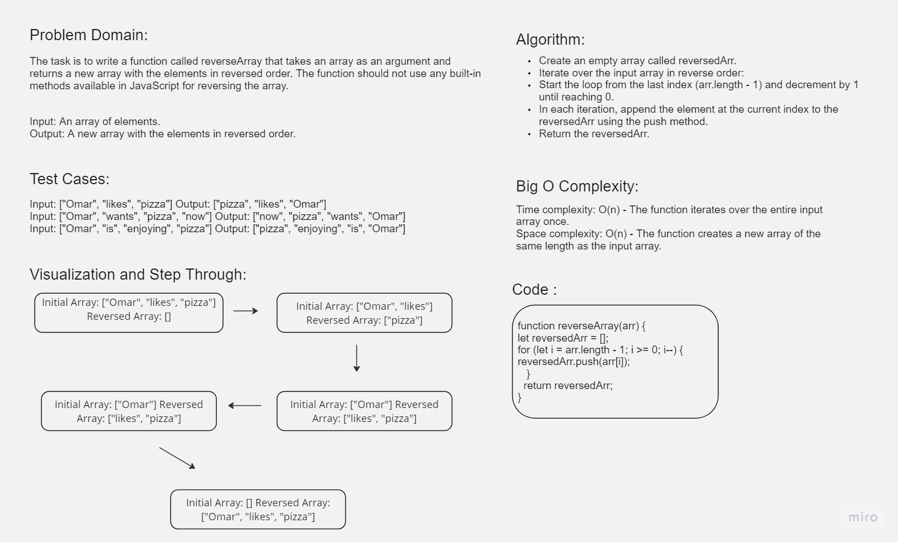

# data-structures-and-algorithms

In this coding challenge, we implemented the reverseArray function in JavaScript. This function takes an array as input and returns a new array with its elements in reversed order. We achieved this without using any built-in array reversal methods. The function was tested with different input arrays, and the expected output was verified. We also provided a visualization and included an image of the whiteboard where we worked on the problem.

