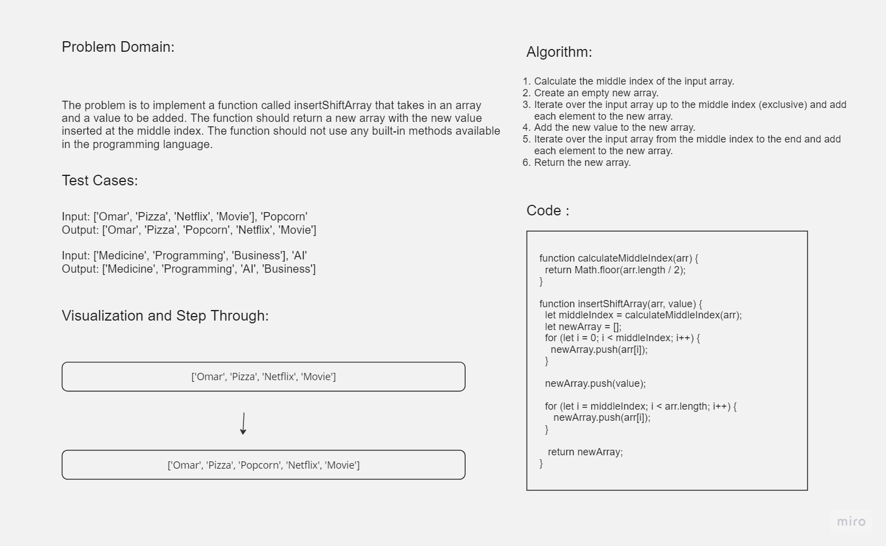

# Challenge Title

Insert Shift Array

## Whiteboard Process



## Problem Domain

The problem is to implement a function called `insertShiftArray` that takes in an array and a value to be added. The function should return a new array with the new value inserted at the middle index. The function should not use any built-in methods available in the programming language.

## Approach & Efficiency

1. Calculate the middle index of the input array.
2. Create an empty new array.
3. Iterate over the input array up to the middle index (exclusive) and add each element to the new array.
4. Add the new value to the new array.
5. Iterate over the input array from the middle index to the end and add each element to the new array.
6. Return the new array.

The time complexity of this solution is O(n) because we iterate over the input array once to create the new array. The space complexity is also O(n) because we create a new array to store the result.

## Solution

```javascript
function calculateMiddleIndex(arr) {
  return Math.floor(arr.length / 2);
}

function insertShiftArray(arr, value) {
  const middleIndex = calculateMiddleIndex(arr);
  const newArray = [];

  for (let i = 0; i < middleIndex; i++) {
    newArray.push(arr[i]);
  }

  newArray.push(value);

  for (let i = middleIndex; i < arr.length; i++) {
    newArray.push(arr[i]);
  }

  return newArray;
}
