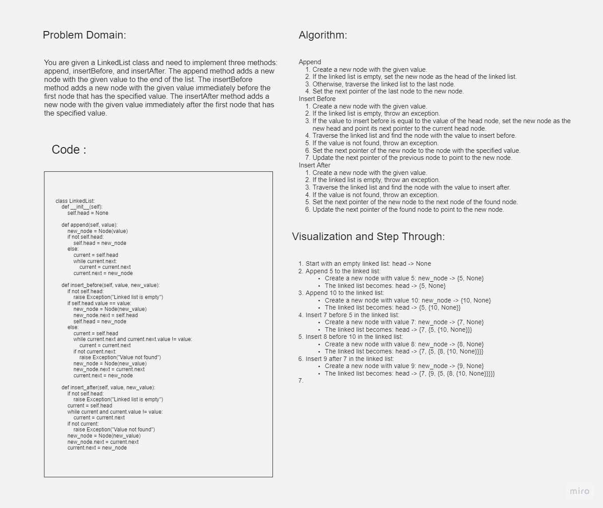

# Challenge Title: Bearer Authorization

## Whiteboard Process



## Approach & Efficiency

The implemented methods in the LinkedList class have the following time and space complexity:

- `append` method: Time complexity is O(n), where n is the number of nodes in the linked list. Space complexity is O(1).
- `insert_before` method: Time complexity is O(n), where n is the number of nodes in the linked list. Space complexity is O(1).
- `insert_after` method: Time complexity is O(n), where n is the number of nodes in the linked list. Space complexity is O(1).

## Solution

```python
class LinkedList:
    def __init__(self):
        self.head = None

    def append(self, value):
        new_node = Node(value)
        if not self.head:
            self.head = new_node
        else:
            current = self.head
            while current.next:
                current = current.next
            current.next = new_node

    def insert_before(self, value, new_value):
        if not self.head:
            raise Exception("Linked list is empty")
        if self.head.value == value:
            new_node = Node(new_value)
            new_node.next = self.head
            self.head = new_node
        else:
            current = self.head
            while current.next and current.next.value != value:
                current = current.next
            if not current.next:
                raise Exception("Value not found")
            new_node = Node(new_value)
            new_node.next = current.next
            current.next = new_node

    def insert_after(self, value, new_value):
        if not self.head:
            raise Exception("Linked list is empty")
        current = self.head
        while current and current.value != value:
            current = current.next
        if not current:
            raise Exception("Value not found")
        new_node = Node(new_value)
        new_node.next = current.next
        current.next = new_node
