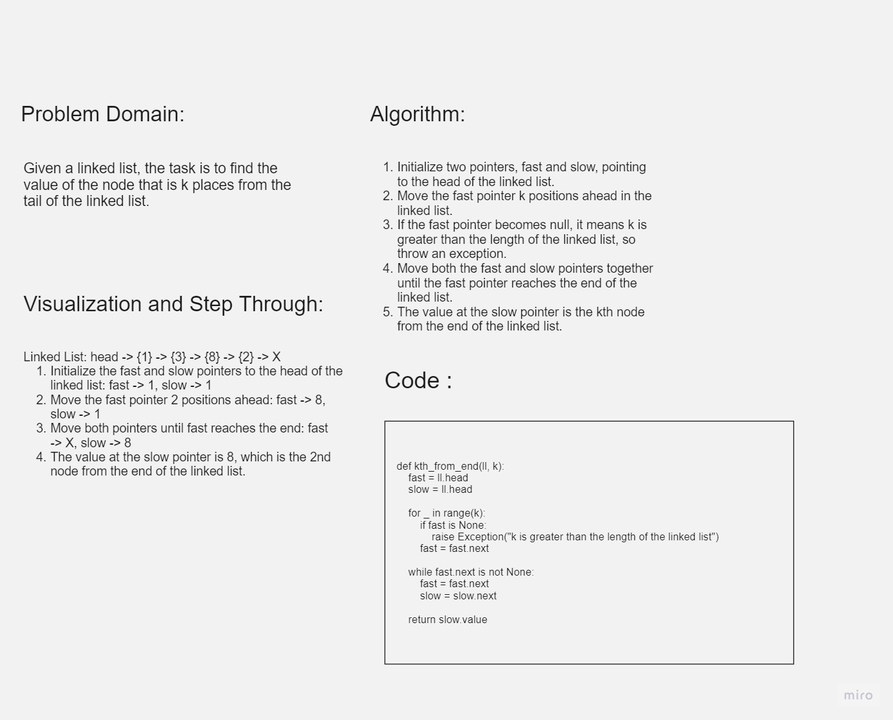

# Challenge Title

Kth from End in Linked List

## Whiteboard Process



## Approach & Efficiency

- Initialize two pointers, `fast` and `slow`, to the head of the linked list.
- Move the `fast` pointer k positions ahead in the linked list.
- If the `fast` pointer becomes null, it means k is greater than the length of the linked list, so throw an exception.
- Move both the `fast` and `slow` pointers together until the `fast` pointer reaches the end of the linked list.
- The value at the `slow` pointer is the kth node from the end of the linked list.

The time complexity of this approach is O(N), where N is the length of the linked list, as we iterate through the list twice. The space complexity is O(1) as we are not using any extra space that grows with the input size.

## Solution

```javascript
function kthFromEnd(linkedList, k) {
  let fast = linkedList.head;
  let slow = linkedList.head;


  for (let i = 0; i < k; i++) {
    if (!fast) {
      throw new Error("k is greater than the length of the linked list");
    }
    fast = fast.next;
  }


  while (fast.next) {
    fast = fast.next;
    slow = slow.next;
  }

  return slow.value;
}
