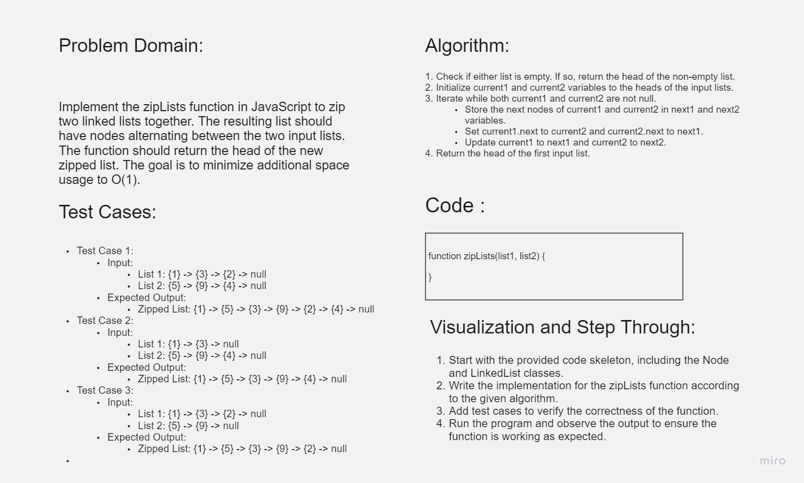

# Challenge Title

Linked List Zip

## Whiteboard Process



## Approach & Efficiency

To solve the linked list zip problem, we followed the following approach:

1. Create a new linked list to store the zipped result.
2. Initialize two pointers, `current1` and `current2`, to the heads of the input linked lists.
3. Iterate through the linked lists while either `current1` or `current2` is not null:
   - Append the node from `current1` to the new linked list if it exists.
   - Move `current1` to the next node if it exists.
   - Append the node from `current2` to the new linked list if it exists.
   - Move `current2` to the next node if it exists.
4. Return the head of the new linked list.

The time complexity of this approach is O(n), where n is the total number of nodes in the input linked lists. This is because we iterate through the lists once to zip the nodes.

## Solution

```javascript
function zipLists(list1, list2) {
  let result = new LinkedList();
  let current1 = list1.head;
  let current2 = list2.head;

  while (current1 !== null || current2 !== null) {
    if (current1 !== null) {
      result.append(current1.value);
      current1 = current1.next;
    }
    if (current2 !== null) {
      result.append(current2.value);
      current2 = current2.next;
    }
  }

  return result.head;
}
