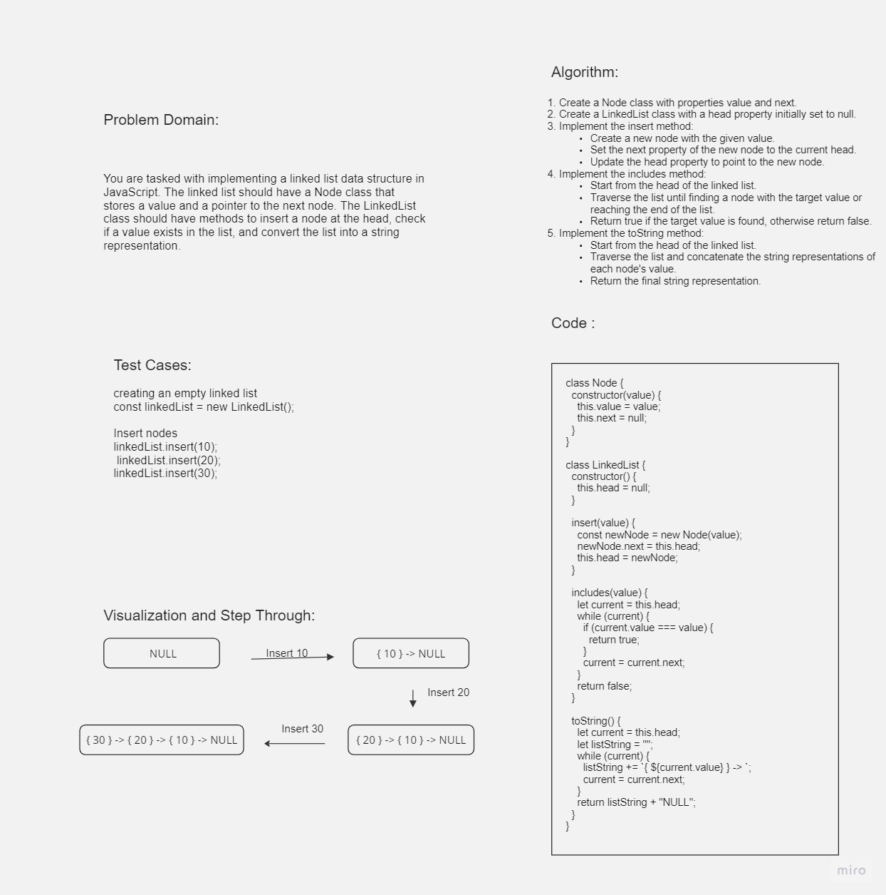

# Challenge Title

Linked List Implementation in JavaScript

## Whiteboard Process



## Approach & Efficiency

To implement the linked list, we created two classes: `Node` and `LinkedList`. The `Node` class represents a node in the linked list and has properties for the value and a pointer to the next node. The `LinkedList` class represents the linked list itself and has methods for inserting a node at the head, checking if a value exists in the list, and converting the list into a string representation.

## Solution

The code for the linked list implementation can be found in the following files:

- `Node.js`: Contains the `Node` class definition.
- `LinkedList.js`: Contains the `LinkedList` class definition.

To use the linked list, you can create an instance of the `LinkedList` class and call the methods accordingly. Here's an example of how to use the linked list:

```javascript
const linkedList = new LinkedList();
linkedList.insert(10);
linkedList.insert(20);
linkedList.insert(30);
console.log(linkedList.toString()); 
console.log(linkedList.includes(20)); 
console.log(linkedList.includes(40));
