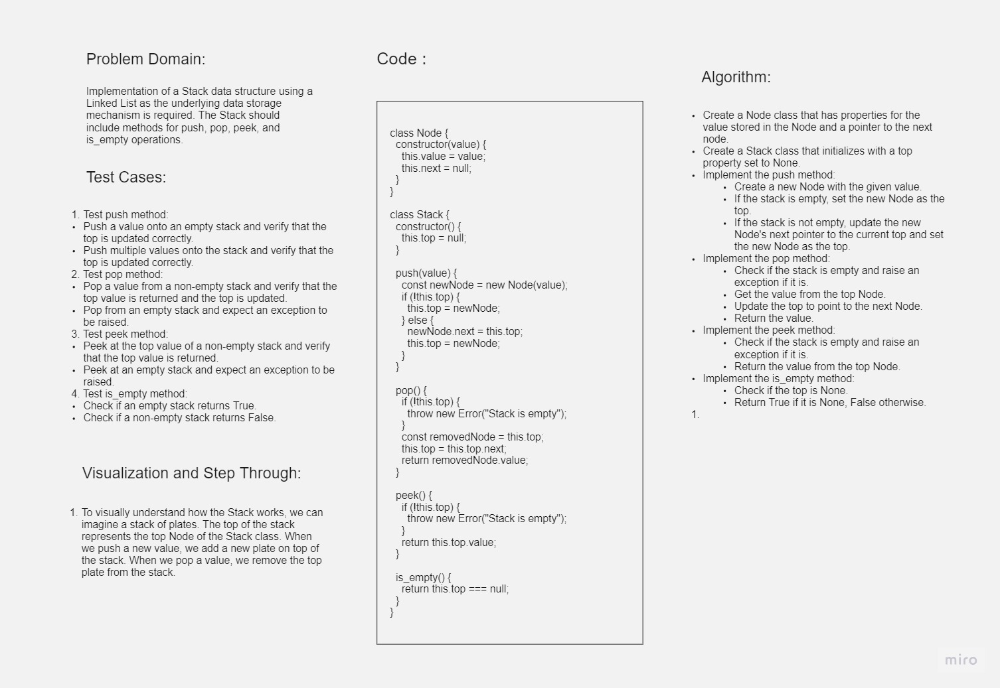

# Challenge Title

Implementation: Stacks and Queues

## Whiteboard Process



## Approach & Efficiency

For the implementation of the Stack using a Linked List, we maintain a reference to the top node of the stack.

- The push method inserts a new node at the top of the stack, which takes O(1) time complexity.
- The pop method removes the top node from the stack and returns its value, also with O(1) time complexity.
- The peek method returns the value of the top node without removing it, again with O(1) time complexity.
- The is_empty method checks if the stack is empty by checking if the top is null, which is also an O(1) operation.

The space complexity of this implementation is O(n), where n is the number of elements in the stack, as we need memory to store each node.

## Solution

```javascript
class Node {
  constructor(value) {
    this.value = value;
    this.next = null;
  }
}

class Stack {
  constructor() {
    this.top = null;
  }

  push(value) {
    const newNode = new Node(value);
    if (!this.top) {
      this.top = newNode;
    } else {
      newNode.next = this.top;
      this.top = newNode;
    }
  }

  pop() {
    if (!this.top) {
      throw new Error("Stack is empty");
    }
    const removedNode = this.top;
    this.top = this.top.next;
    return removedNode.value;
  }

  peek() {
    if (!this.top) {
      throw new Error("Stack is empty");
    }
    return this.top.value;
  }

  is_empty() {
    return this.top === null;
  }
}
