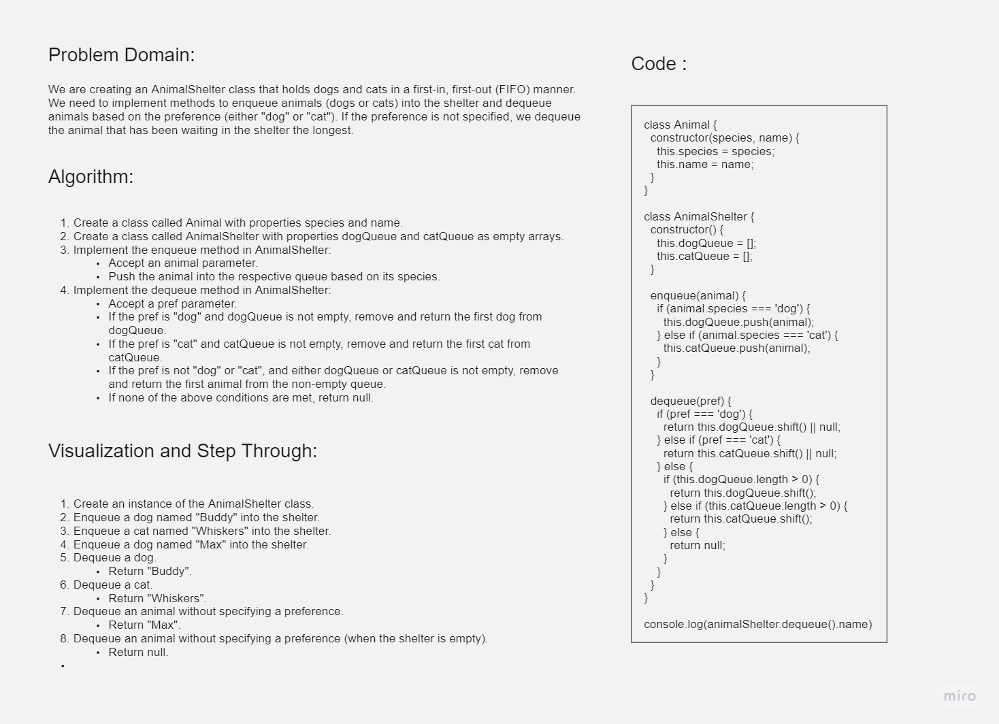

# Challenge Title: Stack Queue Animal Shelter

## Whiteboard Process



## Approach & Efficiency

To solve this challenge, I implemented the AnimalShelter class with separate queues for dogs and cats. The enqueue method simply adds the animal to the respective queue based on its species. The dequeue method first checks if the preferred animal is available in the corresponding queue. If so, it removes and returns the first animal from that queue. If the preferred animal is not available or the preference is "any", it checks if there are any animals in either queue and returns the first animal that has been waiting in the shelter the longest.

The time complexity of both the enqueue and dequeue methods is O(1) as they involve simple queue operations like enqueue, dequeue, and length checks.

## Solution

(Provide the code solution for the AnimalShelter class here.)

```javascript
class Animal {
  constructor(species, name) {
    this.species = species;
    this.name = name;
  }
}

class AnimalShelter {
  constructor() {
    this.dogs = []; 
    this.cats = [];  
  }

  enqueue(animal) {
    if (animal.species === 'dog') {
      this.dogs.push(animal);
    } else if (animal.species === 'cat') {
      this.cats.push(animal);
    }
  }

  dequeue(pref) {
    if (pref === 'dog') {
      if (this.dogs.length > 0) {
        return this.dogs.shift();
      }
    } else if (pref === 'cat') {
      if (this.cats.length > 0) {
        return this.cats.shift();
      }
    } else if (pref !== 'dog' && pref !== 'cat') {
      if (this.dogs.length > 0) {
        return this.dogs.shift();
      } else if (this.cats.length > 0) {
        return this.cats.shift();
      }
    }

    return null;
  }
}
