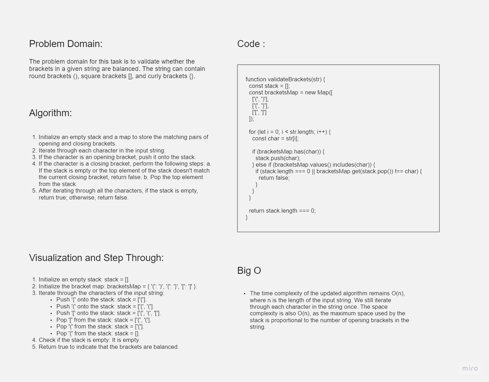

# Challenge Title: Bracket Validation

## Whiteboard Process



## Approach & Efficiency

The approach to solving the bracket validation problem is to use a stack data structure. We iterate through each character in the input string and perform push and pop operations on the stack based on the bracket characters encountered. We also utilize a map to store the matching pairs of opening and closing brackets.

The time complexity of the algorithm is O(n), where n is the length of the input string, as we iterate through each character once. The space complexity is also O(n), as the stack's maximum space usage is proportional to the number of opening brackets in the string.

## Solution

Here is the solution implemented in JavaScript:

```javascript
function validateBrackets(str) {
  const stack = [];
  const bracketsMap = new Map([
    ['(', ')'],
    ['{', '}'],
    ['[', ']']
  ]);

  for (let i = 0; i < str.length; i++) {
    const char = str[i];

    if (bracketsMap.has(char)) {
      stack.push(char);
    } else if (bracketsMap.values().includes(char)) {
      if (stack.length === 0 || bracketsMap.get(stack.pop()) !== char) {
        return false;
      }
    }
  }

  return stack.length === 0;
}
