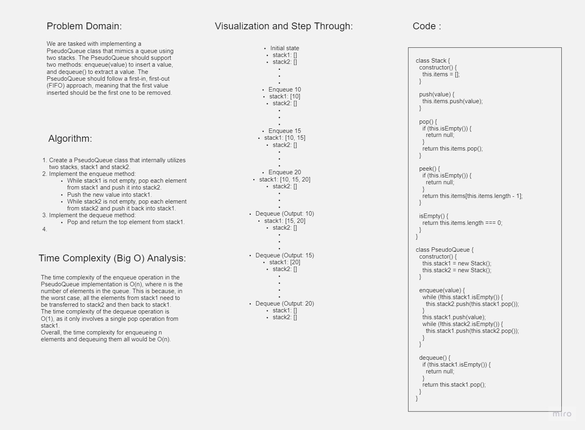

# PseudoQueue

The PseudoQueue class is an implementation of a queue using two stacks in JavaScript.

## Whiteboard Process



## Approach & Efficiency

The PseudoQueue class is implemented using two stacks to mimic the behavior of a queue. The approach involves utilizing stack operations to maintain the first-in, first-out (FIFO) order.

### Enqueue Operation

1. To enqueue a value, all elements from `stack1` are transferred to `stack2`.
2. The new value is then pushed into `stack1`.
3. Finally, the elements are transferred back from `stack2` to `stack1`.

### Dequeue Operation

1. To dequeue a value, the top element from `stack1` is popped and returned.

The time complexity of the enqueue operation is O(n), where n is the number of elements in the queue. This is because in the worst case, all elements from `stack1` need to be transferred to `stack2` and then back to `stack1`. However, the dequeue operation has a time complexity of O(1), as it only involves a single pop operation from `stack1`.

The space complexity of the PseudoQueue class is O(n), where n is the number of elements in the queue. This is due to the additional space required for the two stacks.

## Solution

Here's an example of how to use the PseudoQueue class:

```javascript
const queue = new PseudoQueue();
queue.enqueue(10);
queue.enqueue(15);
queue.enqueue(20);
console.log(queue.dequeue()); 
console.log(queue.dequeue()); 
console.log(queue.dequeue());
