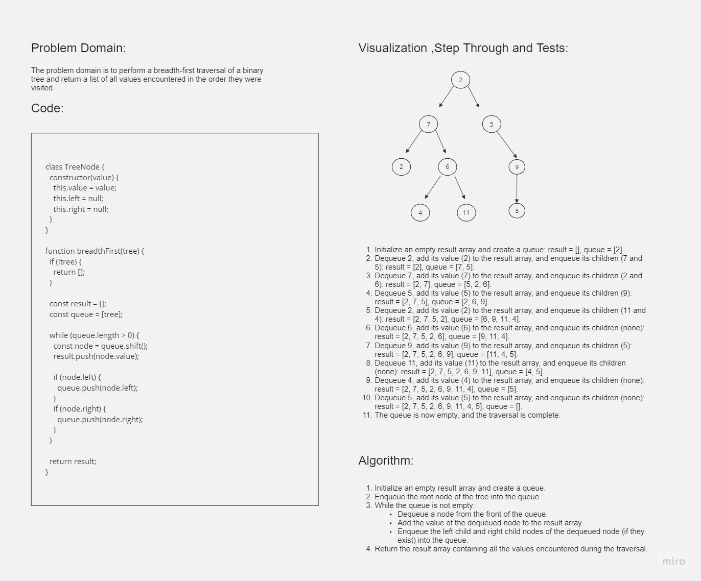

# Breadth-First Tree Traversal

## Whiteboard Process

## Approach & Efficiency

To perform a Breadth-First Tree Traversal, we use a queue data structure to keep track of the nodes we need to visit. We start with the root node and enqueue it into the queue. While the queue is not empty, we dequeue a node, add its value to the result array, and enqueue its left and right children (if they exist). We continue this process until the queue becomes empty, and all nodes have been visited.

The time complexity of the Breadth-First Tree Traversal algorithm is O(n), where n is the number of nodes in the tree. This is because we need to visit each node once. The space complexity is also O(n), as in the worst case, all nodes can be in the queue at the same time.

## Solution

To use the Breadth-First Tree Traversal algorithm, you can call the `breadthFirst` function and pass the root node of the tree as an argument. The function will return an array containing all the values encountered during the traversal, in the order they were encountered.
