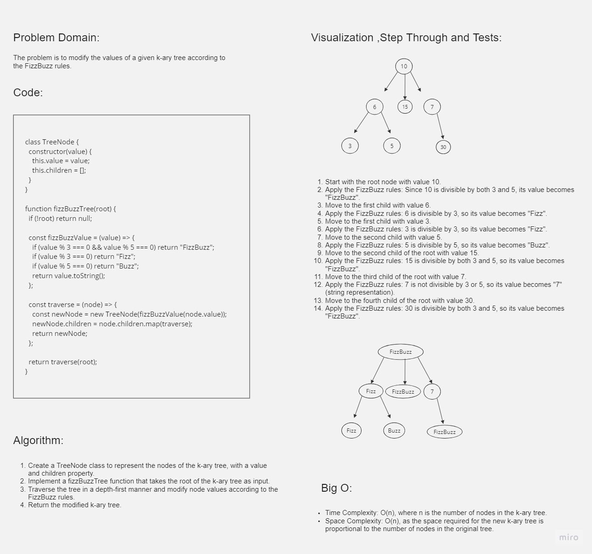

# FizzBuzz Tree

## Whiteboard Process



## Approach & Efficiency

The approach for solving the FizzBuzz Tree challenge involved traversing the given k-ary tree in a depth-first manner while applying the FizzBuzz rules to modify the node values. We used a recursive approach to traverse the tree and create a new tree with the modified values.

The time complexity of the solution is O(n), where n is the number of nodes in the k-ary tree, as we visit each node once during the traversal. The space complexity is also O(n) due to the space required for the new k-ary tree, which is proportional to the number of nodes in the original tree.

## Solution

To use the FizzBuzz Tree function, create a k-ary tree and pass its root node as an argument to the `fizzBuzzTree` function. The function will return a new k-ary tree with the node values modified according to the FizzBuzz rules.

```javascript

function createTreeNode(value, children) {
  const node = new TreeNode(value);
  node.children = children;
  return node;
}

const root = createTreeNode(10, [
  createTreeNode(6, [
    createTreeNode(3, []),
    createTreeNode(5, []),
  ]),
  createTreeNode(15, []),
  createTreeNode(7, []),
  createTreeNode(30, []),
]);

const newTree = fizzBuzzTree(root);
console.log(newTree);
