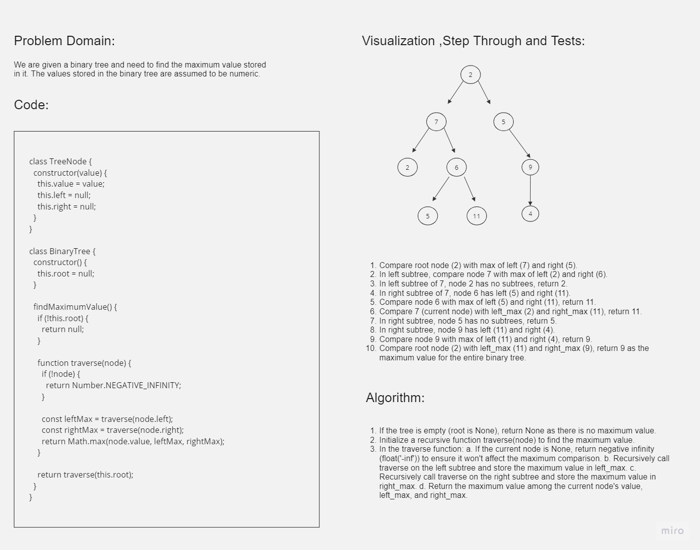

# Challenge Title

Finding the Maximum Value in a Binary Tree

## Whiteboard Process



## Approach & Efficiency

**Approach:**
To find the maximum value stored in a binary tree, we use a recursive depth-first traversal approach. Starting from the root, we compare each node's value with the maximum values from its left and right subtrees. The maximum value found in this comparison is then used as the result.

**Efficiency:**

- Time Complexity: O(n) - Visits all nodes in the worst case.
  
- Space Complexity: O(h) - Call stack height is the tree's height (log(n) for balanced, n for skewed).

## Solution

JavaScript code for the `TreeNode` and `BinaryTree` classes with the `findMaximumValue` method:

```javascript
class TreeNode {
  constructor(value) {
    this.value = value;
    this.left = null;
    this.right = null;
  }
}

class BinaryTree {
  constructor() {
    this.root = null;
  }

  findMaximumValue() {
    if (!this.root) return null;

    function traverse(node) {
      if (!node) return Number.NEGATIVE_INFINITY;
      const leftMax = traverse(node.left);
      const rightMax = traverse(node.right);
      return Math.max(node.value, leftMax, rightMax);
    }

    return traverse(this.root);
  }
}
