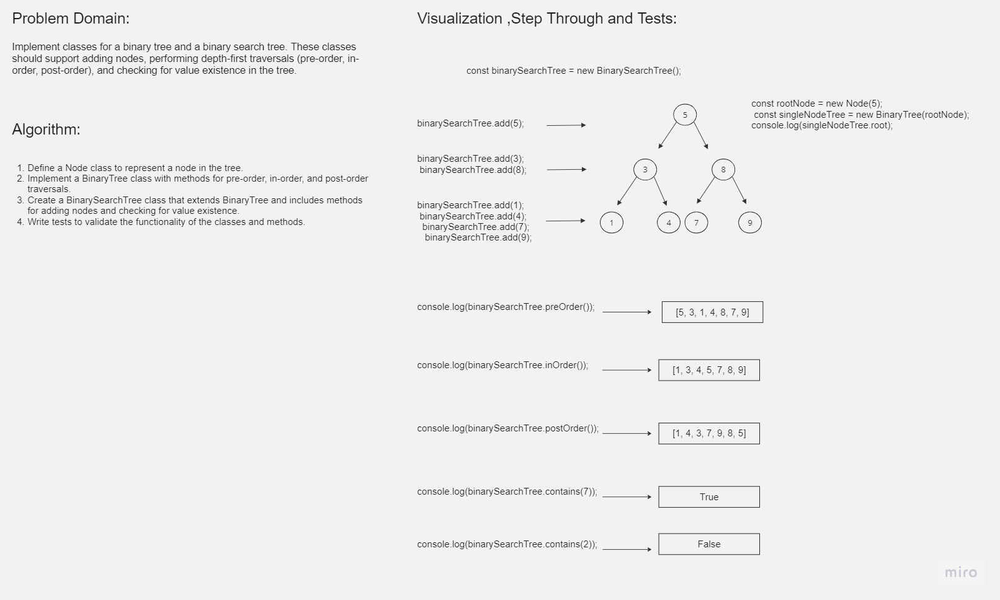

# Challenge Title

Binary Tree and Binary Search Tree Implementation

## Whiteboard Process

## Approach & Efficiency

The approach involves implementing two classes: `BinaryTree` and `BinarySearchTree`. The `BinaryTree` class provides methods for adding nodes, performing depth-first traversals (pre-order, in-order, post-order), and checking value existence. The `BinarySearchTree` class extends `BinaryTree` and adds additional methods to maintain the binary search tree property.
